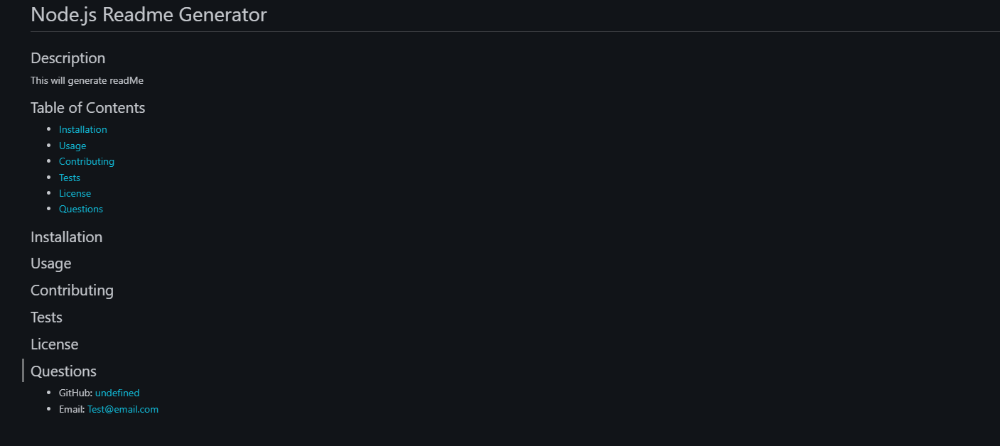

# Node.js Readme Generator

## Description
This will generate a Readme file after answering a series of questions. 
Questions will be title of project, table of contect, descriptions, installation, usage, license, contribution, testing, and contacts.

# usage
using Node.js to create a readme file

# screenshot

https://www.awesomescreenshot.com/video/17220882?key=5b4cdf7d3261a4ac06f04eb1132facb3

 

